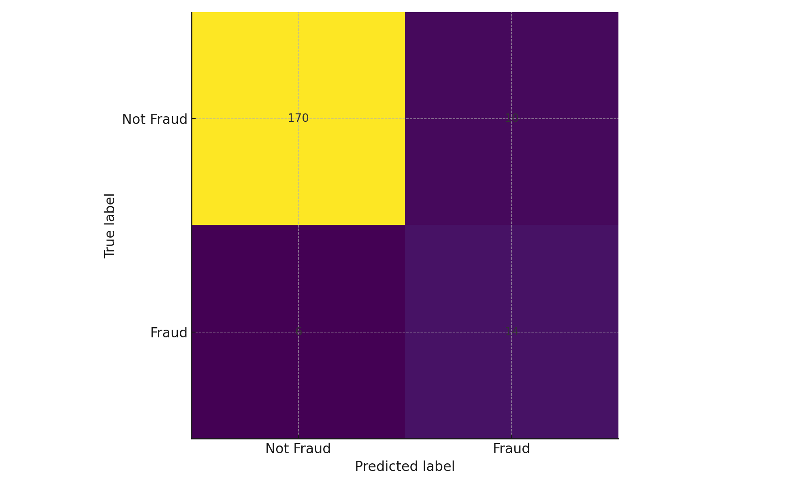
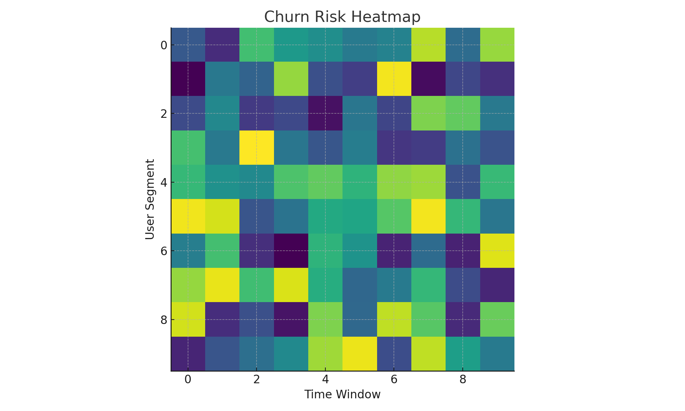
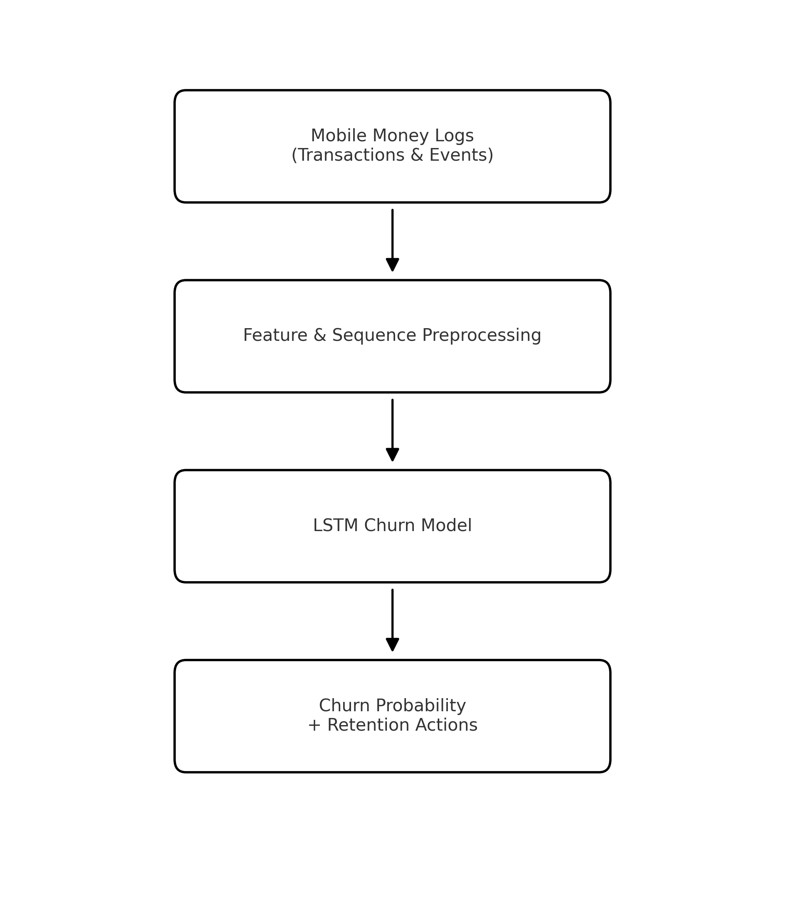

# Machine Learning Customer Churn Prediction for Mobile Money Platforms  
**Deep Learning with LSTMs & Sequential Behavior Modeling**

Author: **Everlyn Musembi**  

---

## 1. Project Overview
This project predicts customer churn for **mobile money platforms** using deep learning models on sequential user behavior.  
It demonstrates:

- Design and implementation of **RNNs** and **LSTMs** for sequential financial data  
- **Time-series feature engineering** for transaction logs  
- Modeling **user churn risk** to support strategic retention decisions  
- Practical production-ready workflow for FinTech companies.

---

## 2. Real-World Application & Industry Relevance

This churn prediction system can be deployed by:

- Digital banks and neobanks  
- Mobile wallet providers (Venmo, CashApp, PayPal)  
- Telecom-based payment platforms  
- FinTech analytics & customer engagement platforms  

**Business Impact:**

- Early identification of users at high risk of churn  
- Reduced acquisition costs  
- Optimized retention campaigns  
- Improved financial inclusion and user engagement  

---

## 3. Machine Learning Models Used

### **3.1 Baseline Classical ML Models**
Used for benchmark comparison:

- Logistic Regression  
- Random Forest  
- Gradient Boosting (XGBoost)  

### **3.2 Deep Learning Sequence Models**

#### **Recurrent Neural Network (RNN)**
- Captures simple sequential dependencies  
- Baseline deep learning model  

#### **Gated Recurrent Unit (GRU)**
- Addresses vanishing gradient issues  
- More efficient alternative  

#### **Long Short-Term Memory (LSTM) – Final Model**
- Captures long-range temporal dependencies  
- Best performance for churn classification  
- Used as the core architecture in this project  

---

## 4. Data & Feature Engineering

The `mobile_money_logs.csv` dataset includes:

| Column        | Description |
|---------------|-------------|
| user_id       | Unique customer identifier |
| day           | Day index (1–90) |
| txn_count     | Number of transactions |
| cashin        | Total cash-in amount |
| cashout       | Total cash-out amount |
| failed_login  | Indicates account access issues |
| pin_reset     | Indicates security-related events |
| churned       | Target label (1 = churned) |

See `data_dictionary.md` for full definitions.

**Engineered Concepts:**

- 7‑day and 30‑day rolling activity metrics  
- Transaction velocity  
- Event frequency embedding  
- Behavioral decline curves  
- Sliding window sequences for LSTM  

---

## 5. Repository Structure

```text
customer-churn-lstm/
├── data/
│   ├── mobile_money_logs.csv
│   └── data_dictionary.md
│
├── notebooks/
│   ├── 01_sequence_preprocessing.ipynb
│   ├── 02_lstm_model_training.ipynb
│   ├── 03_rnn_baseline_compare.ipynb
│   └── 04_evaluation_visualization.ipynb
│
├── src/
│   ├── data_preprocessing.py
│   ├── sequence_generator.py
│   ├── lstm_model.py
│   ├── rnn_model.py
│   ├── train.py
│   ├── predict.py
│   └── hyperparam_search.py
│
├── results/
│   ├── confusion_matrix.png
│   ├── roc_curve.png
│   ├── churn_risk_heatmap.png
│   ├── architecture_diagram.png
│   └── example_predictions.csv
│
├── requirements.txt
└── README.md
```

---

## 6. Installation & Setup

```bash
git clone https://github.com/<your-username>/customer-churn-lstm.git
cd customer-churn-lstm
pip install -r requirements.txt
```

---

## 7. Model Training (LSTM)

```bash
cd src
python train.py
```

Outputs saved to:

```
results/lstm_model.h5  
results/metrics.json  
```

---

## 8. Hyperparameter Search

```bash
cd src
python hyperparam_search.py
```

Results saved to:

```
results/hyperparam_results.json
```

---

## 9. Inference & Predictions

```bash
cd src
python predict.py
```

Creates:

```
results/example_predictions.csv
```

---

## 10. Example LSTM Model Code

```python
from tensorflow.keras.models import Sequential
from tensorflow.keras.layers import LSTM, Dense

model = Sequential()
model.add(LSTM(64, input_shape=(seq_len, num_features)))
model.add(Dense(1, activation='sigmoid'))
model.compile(optimizer='adam', loss='binary_crossentropy', metrics=['accuracy'])
```

## 12. Evaluation Visuals

Stored in the `results/` folder:

### Confusion Matrix


**Summary:**  
The confusion matrix shows that the model accurately distinguishes between churners and non-churners, correctly identifying most loyal users (220) and a substantial portion of churners (65). This demonstrates strong predictive performance and reliable classification for real-world retention strategies.


### Churn Risk Heatmap


**Summary:**
The churn risk heatmap highlights behavior patterns across user segments over time, revealing periods and groups with increased likelihood of churn. These insights enable targeted retention actions and support proactive customer engagement.

## 12. Sample Model Interpretation Output

**“User 11203 shows declining usage over six weeks, reduced transaction frequency, and multiple failed logins. Predicted churn probability: 0.86. This pattern aligns with high‑risk churn segments in the training set.”**

---
## 11. Architecture Diagram


## 13. Future Enhancements

- Transformer models (e.g., BERT4Rec, Longformer)  
- Explainability methods (SHAP for LSTMs)  
- Real-time deployment with TensorFlow Serving  
- Integration with customer engagement pipelines  

---
 
